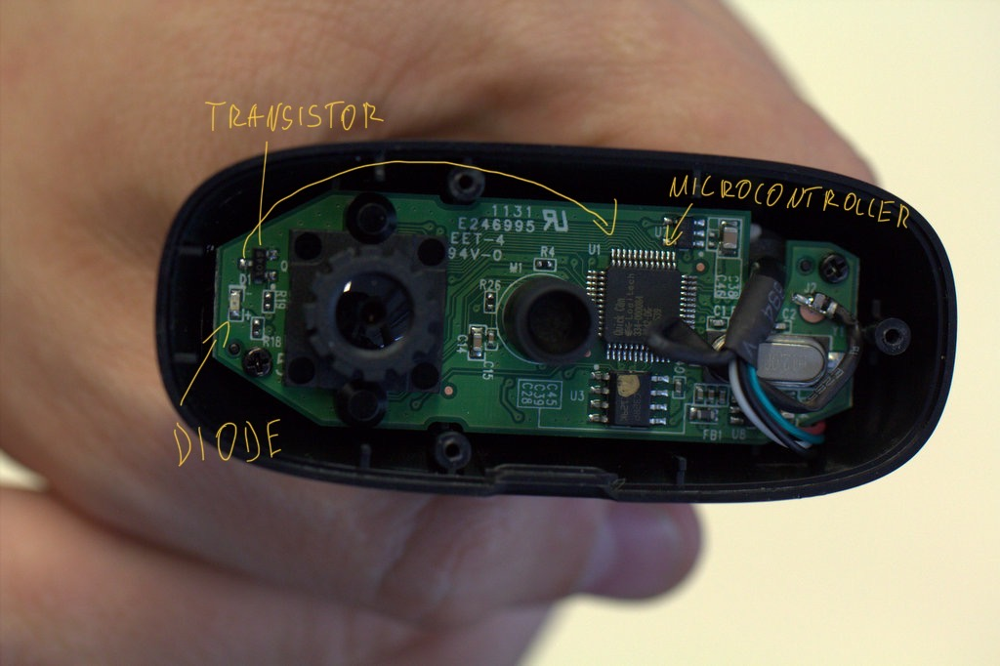

# Logitech C270

Analysis of the MacOs `LogitechWebcamComponent` Framework and WebCam Hardware.
The `LogitechWebcamComponent.framework` can be found in the "LogiCameraSettings_2.6.2.pkg" package or a in any other Logitech Webcam app for Mac, since it is the core lib for interacting with Logitech libraries.
The disassembly was done with IDA Pro, the `LogitechWebcamComponent.framework` can be found in `LogitechWebcamComponent.framework/Libraries/libwebcamLib.dylib`.

## `LogitechWebcamComponent` Analysis:  

### Functions/ Exports:

#### VCInterface_:
Video Control Interface
Resembles the standard Video Control Interface for basic configurations and oprerations with the camera.
Logitech's

#### ACL_ Interface: Bluetooth Protocol:

https://en.wikipedia.org/wiki/USB_video_device_class

ACL is part of the Bluetooth operations/ protocol stack and is exclusively used to transport data. The opposit to ACL is sco,which is mainly used for Voice Communication (or data and voice combined) and does not offer retransmissions.
It can be seen as the Video Control Interface for Bluetooth

The ACL_ methods provide basic operations to handle Bluetooth Device management and basic control commands

#### LAC_, LACCM_:

depend on ACL flags and objects.  Offer methods for Bluetooth data and device management.

#### LVCMM_, LVC_, LVUVC_, LogiUVC_ Interface:
Logitech Video Control Manager, Logitech Video Controller, Logitech Video Universal USB Controller, Logitech USB Video Class

LVCMM_, LVC which handle basic device event management and video format,resolution configuration. LVUVC_ handles video device get/set methods.

The LogiUVC_ methods implement camera device discovery/ scanning.
The USB video device class (also USB video class or UVC) is a USB device class that describes devices capable of streaming video like webcams, digital camcorders, transcoders, analog video converters and still-image cameras.
The latest revision of the USB video class specification carries the version number 1.5 and was defined by the USB Implementers Forum in a set of documents describing both the basic protocol and the different payload formats

### Import functions:

#### IOKit, Core Media IO, Core Video Framework:

Logitech Core API implements methods from the IOKit Framework to manage low lvl communication with the webcam. To handle data streams and basic configuration apples CoreMediaIO (CM)Framework is use.
For further Video(data) stream operations Logitech utalizes Apples Core Video Framework (CV).

## Hardware:

The PCB of the webcam consists of 5 main components, which are the camera, the microphone, a microcontroller, a quarts, an eprom.
All of those main components are connected to the microcontroller, the eprom is propably used as buffer for imgs and the qurts to synchronize video frame rate.  
The diode, responsible for the indication light is connected to ground via. a transistor which is connecterd to a onboard IC.

## **Possible** Indicator Light bypass

Since the indicator LED is more or less directly connected to the microcontroller and their is no indication of direct LED control through the software drivers on the computer(the analysed Logi techWebcamComponent). It can only be assumed that the LED is controlled by the firmware on the onboard microcontroller.
Also, there are a few big chunks of data which are obfuscated/ encrypted or could be firmware for the onboard microcontroller. The data chunks found are 2.4 mb and 118 kb in size and require further intelligence to tell if they are firmware. If it was firmware, it would give us control over the IC, which would be a very powerfull attack vector since the IC controls the LED.   
In summary it can be assumed that, their is no obvious or easy to exploit issue in the software stack concept.
